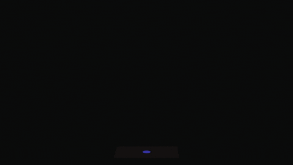

🌟 My Skills tools

<h1>Moises Santos da Luz</h1>  

Desenvolvedor Front-end, em destaque, desenvolvimento em | HTML | CSS | JavaScript | React | PHP |, com paixão e dedicação em criar experiências de usuário bonitas e funcionais.

<h3>💼 Current project</h3>

if ($gostou) { 
 $status = follow; 
} else { 
 $status = go to my repository; 
}

 ### Tecnologias que eu uso no meu dia.

 
 
 
 
           
 
    

 
  
 
  ### Algumas das minhas redes socias!!
 

  
  
  
 

